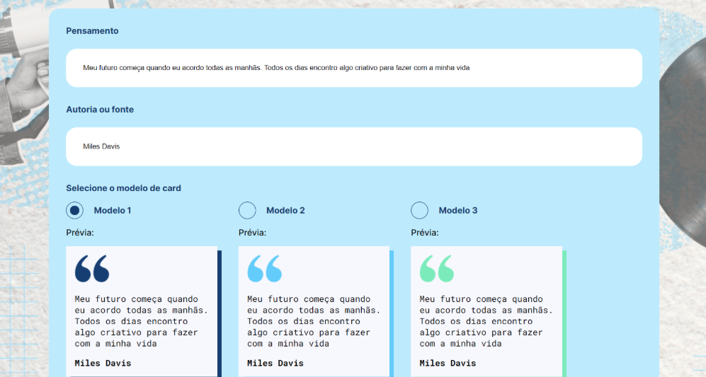

# Memoteca



Memoteca é uma aplicação desenvolvida em Angular, projetada para exercitar habilidades de desenvolvimento web. O objetivo do projeto é permitir que os usuários coletem e compartilhem pensamentos inspiradores.

## Tecnologias Utilizadas

- **Angular 14**: Framework para construção de aplicações web.
- **TypeScript**: Linguagem de programação que é um superconjunto do JavaScript.
- **RxJS**: Biblioteca para programação reativa usando Observables.

## Instalação

Para rodar a aplicação localmente, siga os passos abaixo:

1. Clone o repositório:
   ```bash
   git clone https://github.com/seu-usuario/memoteca.git
   ```

2. Navegue até o diretório do projeto:
   ```bash
   cd memoteca
   ```

3. Instale as dependências:
   ```bash
   npm install
   ```

4. Inicie o servidor de desenvolvimento:
   ```bash
   npm start
   ```

5. Acesse a aplicação no seu navegador em `http://localhost:4200`.

## Funcionalidades

- Adicionar pensamentos e citações.
- Selecionar diferentes modelos de apresentação para os cards.
- Visualizar e compartilhar pensamentos inspiradores.

## Contribuição

Contribuições são bem-vindas! Sinta-se à vontade para abrir uma issue ou enviar um pull request.

## Licença

Este projeto está licenciado sob a [MIT License](LICENSE).
